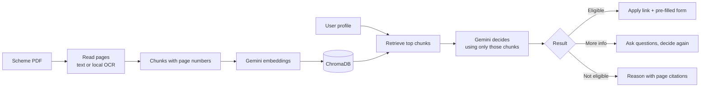

# 📜 Civic & Legal Navigator

A multilingual (English / हिन्दी / ಕನ್ನಡ) web app that checks whether a citizen is eligible for a government scheme. Upload the scheme's guideline PDF, and the app reads it, asks for any missing details, gives a simple verdict with page citations, and points to the official place to apply.

Built with **Python, Streamlit, Gemini API, ChromaDB (RAG) and SQLite**.

> ⚠️ Results are AI-assisted guidance only. Final eligibility is always decided by the scheme's authority.

## Screenshots

<p>
  
  
</p>
<p>
  
  
</p>

## The problem

Scheme documents are long, written in formal language, and often scanned PDFs. Many citizens, especially in rural areas, cannot tell from them whether they qualify or where to apply. This app turns a scheme PDF into a short answer in the user's own language.

## Features

- **Eligibility verdict in 3 colours:** 🟢 eligible, 🟡 more information needed, 🔴 not eligible, with a short explanation in simple words.
- **RAG over the uploaded PDF:** only the most relevant parts of the document are sent to the model, and every rule is cited with a PDF page number.
- **Works on scanned PDFs:** pages are read with a free, local OCR engine (no API quota used), and the results are cached.
- **Follow-up questions:** if the document needs facts the profile does not have (for example caste category or land ownership), the app asks up to two rounds of short questions, then gives a final decision.
- **Official apply link,** chosen in this order: a link written in the document (text or clickable) → a small verified list of portals → an official-site lookup (government `.gov.in` / `.nic.in` domains only, checked to exist) → a web search as a last resort.
- **Three languages:** the interface and the AI report switch between English, Hindi and Kannada.
- **Accounts:** registration and login with SQLite and **bcrypt-hashed passwords**; editable profile.
- **Reliability:** automatic retries, fallback to other Gemini models when one is busy or over quota, and a progress bar while reading the PDF.

## How it works



1. **Load:** text is extracted per page; scanned pages go through local OCR (RapidOCR) and are cached in `.cache/`.
2. **Chunk:** about 250 words per chunk with 50 words of overlap, keeping the page number.
3. **Embed and store:** chunks are embedded with Gemini and stored in an in-memory ChromaDB collection.
4. **Retrieve:** several search queries built from the profile (and later the user's answers) fetch the best chunks.
5. **Generate:** the model answers only from those chunks, at temperature 0, and returns JSON (status, scheme name, apply link, report, follow-up questions). Links are accepted only if they really appear in the document or pass the checks above.

## Tech stack

Python · Streamlit · Google Gemini API (`google-genai`) · ChromaDB · pypdf · RapidOCR (ONNX) · SQLite · bcrypt

## Project structure

```
civic-navigator/
├── agent.py            # Streamlit app: UI, login, languages, result card, follow-up form
├── rag.py              # RAG pipeline: OCR, chunking, embeddings, retrieval, decision, links
├── requirements.txt
├── .env.example        # shows which key is needed (never commit your real .env)
├── .streamlit/
│   └── config.toml     # theme colours
└── data/               # sample scheme PDFs for testing
```

Created at run time (git-ignored): `user_profile.db`, `.cache/`, `.env`.

## Setup

Requires Python 3.10+ (developed on 3.11) and a free Gemini API key from [Google AI Studio](https://aistudio.google.com).

```bash
git clone https://github.com/Manasa13924/civic-legal-navigator.git
cd civic-legal-navigator

python -m venv env
# Windows
env\Scripts\activate
# macOS / Linux
source env/bin/activate

pip install -r requirements.txt
```

Create a `.env` file next to `agent.py`:

```
GEMINI_API_KEY=your_key_here
```

Run the app:

```bash
streamlit run agent.py
```

A demo account is created on first run: username `ramesh`, password `pass123` (stored hashed). You can also register a new account from the login screen.

**First run on a scanned PDF takes a few minutes** while pages are read locally. They are cached, so the same PDF is fast afterwards.

## Configuration

Model names are set at the top of `rag.py` (`LLM_MODEL`, `FALLBACK_MODELS`, `EMBED_MODEL`). Google renames and retires models often, so update them if you see a "model not found" error. The free tier has daily request limits per model; when one is used up, the app tries the next model in the list.

## Evaluation

Fill this in after you run your own test cases.

| # | Profile | Scheme PDF | Expected | Actual | Correct? |
|---|---|---|---|---|---|
| 1 | Farmer, Karnataka | Soil Health Card | Eligible | _fill in_ | |
| 2 | Student, Karnataka | Soil Health Card | Not eligible | _fill in_ | |
| 3 | Farmer, Karnataka | State Scholarship Portal | Not eligible | _fill in_ | |
| 4 | Student, Karnataka | State Scholarship Portal | More info, then a decision | _fill in_ | |
| 5 | Student, no land | PM-KISAN | Not eligible after follow-up | _fill in_ | |

**Result:** _X of Y_ test cases matched the expected answer.

## Limitations

- AI output can be wrong or inconsistent; it is guidance, not an official decision.
- Local OCR on scanned pages sometimes joins words or misreads characters.
- Page numbers in citations are **PDF page numbers**, which can differ from the numbers printed on the pages.
- The apply link can be a web-search link when no official address is found. Users should open only `.gov.in` or `.nic.in` sites.
- The pre-filled form does **not** submit a real application; it only prepares details and links to the official site.
- Only a few portals are in the verified list (`KNOWN_PORTALS` in `rag.py`); others rely on the document or the lookup.
- Follow-up answers live only in the current session and are not saved.

## Roadmap

- Save applications and results per user in SQLite
- Optional profile fields (category, course, land size) to skip some questions
- Read-aloud support for low-literacy users
- Automated evaluation script and a larger test set
- Deployment

## Author

**Manasa M B**, B.E. in Artificial Intelligence and Machine Learning · [LinkedIn](#) · [GitHub](https://github.com/Manasa13924)
